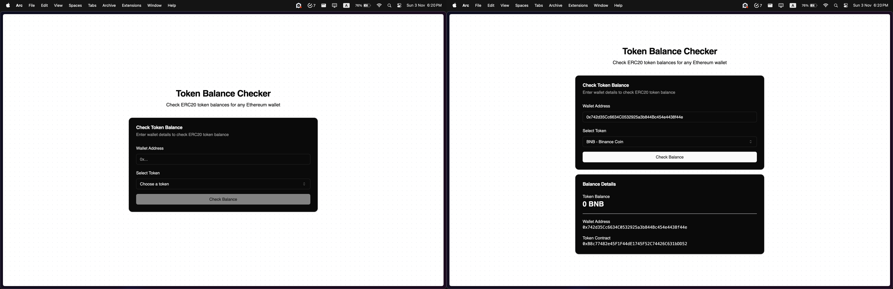

# Token Balance Checker

A modern web application to check ERC20 token balances on the Ethereum network. Built with Next.js, TypeScript, shadcn/ui, and ethers.js.



## Features

- 🌐 Check ERC20 token balances for any Ethereum wallet
- 🔒 Support for popular tokens (USDT, USDC, BNB)
- ✨ Custom token address support
- 🎨 Modern UI with dark mode support
- ⚡ Real-time balance updates
- 🛡️ Type-safe implementation
- 🎯 Error handling and loading states

## Architecture

```
src/
  ├── app/
  │   ├── api/
  │   │   └── token/
  │   │       └── balance/
  │   │           └── route.ts    # API endpoint
  │   └── page.tsx                # Main page
  ├── components/
  │   └── token-balance/
  │       ├── token-balance-form.tsx
  │       ├── balance-display.tsx
  │       └── loading-skeleton.tsx
  ├── constants/
  │   └── tokens.ts
  ├── hooks/
  │   └── use-token-balance.ts
  └── types/
      └── token.ts
```

## Prerequisites

- Node.js 16.x or later
- npm or yarn
- Alchemy API key or any Ethereum node provider

## Environment Setup

1. Create a `.env.local` file in the root directory:

```env
# Ethereum RPC URL (Required)
ETHEREUM_RPC_URL=https://eth-mainnet.g.alchemy.com/v2/your-api-key

# Optional configurations
NEXT_PUBLIC_DEFAULT_CHAIN_ID=1
NEXT_PUBLIC_APP_URL=http://localhost:3000
```

## Installation

1. Clone the repository:
```bash
git clone https://github.com/yourusername/token-balance-checker.git
cd token-balance-checker
```

2. Install dependencies:
```bash
npm install
# or
yarn install
```

3. Run the development server:
```bash
npm run dev
# or
yarn dev
```

4. Open [http://localhost:3000](http://localhost:3000) in your browser.

## API Documentation

### GET /api/token/balance

Fetches the balance of an ERC20 token for a specific wallet address.

#### Request Parameters

| Parameter      | Type   | Description                    | Required |
|---------------|--------|--------------------------------|----------|
| walletAddress | string | Ethereum wallet address        | Yes      |
| tokenAddress  | string | ERC20 token contract address   | Yes      |

#### Response Format

```typescript
interface TokenBalanceResponse {
  success: boolean;
  data?: {
    walletAddress: string;
    tokenAddress: string;
    balance: string;
    symbol: string;
  };
  error?: string;
}
```

#### Example Request

```bash
curl "http://localhost:3000/api/token/balance?walletAddress=0x123...&tokenAddress=0x456..."
```

#### Example Response

```json
{
  "success": true,
  "data": {
    "walletAddress": "0x123...",
    "tokenAddress": "0x456...",
    "balance": "1000.50",
    "symbol": "USDT"
  }
}
```

## Component Documentation

### TokenBalanceForm

Main form component for inputting wallet and token addresses.

```typescript
interface TokenBalanceFormProps {
  onSubmit: (walletAddress: string, tokenAddress: string) => void;
  loading: boolean;
}
```

### BalanceDisplay

Component to display token balance information.

```typescript
interface BalanceDisplayProps {
  data: TokenBalanceData;
}
```

## Error Handling

The application implements comprehensive error handling:

1. Invalid addresses
2. Network errors
3. Contract interaction failures
4. Rate limiting
5. Invalid response formats

## Security Considerations

1. Input validation using ethers.js address validation
2. Rate limiting on API routes
3. Error message sanitization
4. Environment variable protection

## Development

### Code Style

- Uses TypeScript for type safety
- Follows ESLint configuration
- Prettier for code formatting

### Commands

```bash
# Run development server
npm run dev

# Build for production
npm run build

# Start production server
npm start

# Run linting
npm run lint

# Run type checking
npm run type-check
```

## Production Deployment

1. Build the application:
```bash
npm run build
```

2. Set up environment variables on your hosting platform
3. Deploy the application

### Recommended Hosting Platforms

- Vercel (recommended)
- Netlify
- AWS Amplify

## Acknowledgments

- [ethers.js](https://docs.ethers.org/v5/) for Ethereum interactions
- [shadcn/ui](https://ui.shadcn.com/) for UI components
- [Next.js](https://nextjs.org/) for the framework